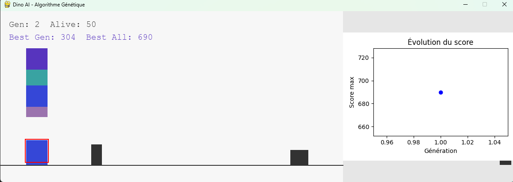
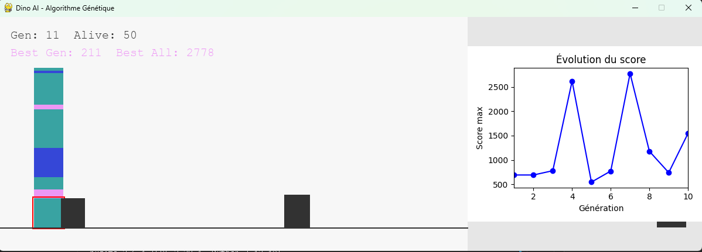

# Dino AI - Algorithme Génétique

Ce projet est une reproduction du jeu Chrome Dinosaur, piloté par une intelligence artificielle évolutive (algorithme génétique + réseau de neurones).

## Fonctionnalités
- Jeu automatique : les dinosaures apprennent à éviter les obstacles.
- Visualisation de l'évolution du score au fil des générations.
- Affichage côte à côte du jeu et du graphe de progression.

## Installation
1. Clonez le dépôt :
   ```bash
   git clone https://github.com/Manos2605/Dinosaur_run.git
   ```
2. Installez les dépendances Python :
   ```bash
   pip install pygame matplotlib numpy
   ```
3. Lancez le script principal :
   ```bash
   python main-IA_visualisation.py
   ```

## Exemple de progression
Ci-dessous, deux captures d'écran illustrant l'évolution du jeu :

### Génération 1


### Génération 10


## Fichiers principaux
- `main-IA_visualisation.py` : jeu + IA + visualisation.
- `main-IA.py` : version sans graphe.
- `server.py` : serveur WebSocket pour communication avec le front.
- `static/` : fichiers HTML/JS/CSS pour interface web.

## Auteur
Manos2605

---
N'hésitez pas à ouvrir une issue ou proposer une amélioration !
